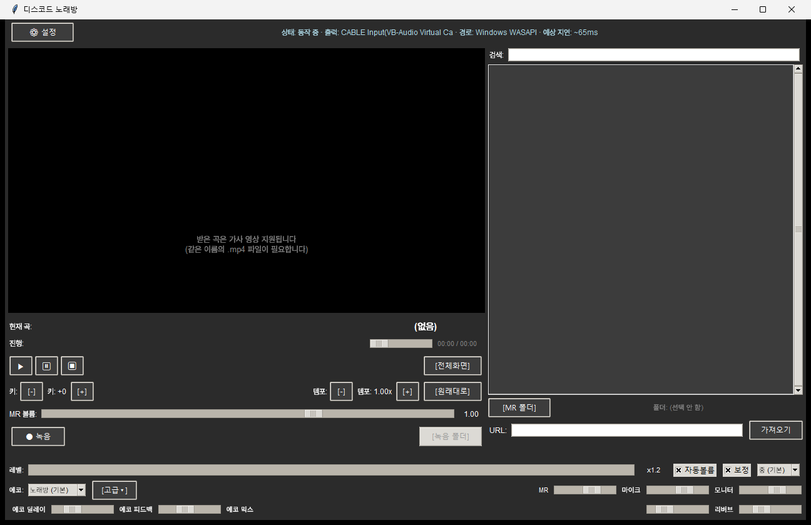

# 🎤 디스코드 노래방 (Discord Karaoke)

**디스코드 음성채널을 노래방으로 만들어주는 Windows 앱.**
유튜브에서 MR(반주)을 가져와 재생하고, 마이크 목소리에 노래방 에코를 걸어 MR과 믹싱한 뒤, 가상 오디오 케이블을 통해 디스코드로 전송합니다. 채널에 있는 사람들은 "반주 + 에코 걸린 목소리"를 실시간으로 듣게 됩니다.



## 동작 원리

```
마이크 ──► [에코/리버브 + 목소리 보정 + 자동볼륨] ──┐
                                                 ├─ 믹싱 ─► VB-Cable ─► 디스코드 마이크 입력
유튜브 MR (mp3) ──► [키/템포 조절] ────────────────┘         └─► 모니터 출력 (내 헤드셋)
유튜브 영상 (mp4) ──► 가사 영상 패널 (재생 위치 동기화)
```

## 주요 기능

- **유튜브 MR 가져오기** — 링크만 붙여넣으면 오디오(mp3)와 가사 영상(mp4)을 함께 저장
- **가사 영상 내장 재생** — 노래방 MR 영상의 가사·진행 표시를 메인 창에서 동기 재생, [전체화면] + 디스코드 화면공유로 모두 함께 보기
- **키(음정) ±6반음 / 템포 0.5~1.5x** 독립 조절 (pedalboard time_stretch)
- **노래방 에코** — 프리셋(노래방/콘서트홀/동굴) + 세부 조절(딜레이/피드백/믹스/리버브)
- **목소리 보정** — 저음 울림 제거 + 컴프레서 + 프레즌스 EQ + 노이즈 게이트 (약/중/강)
- **자동 볼륨(AGC)** — 작은 목소리 자동 증폭(최대 4배), 레벨 미터 표시
- **녹음** — 디스코드로 전송되는 최종 믹스를 그대로 WAV로 저장 (모니터링/보관용)
- **저지연 안정 전송** — WASAPI 자동 선택, 지터 버퍼 클럭 드리프트 보상, 피크 리미터(무손실 통과), 지연 모드 3단계(실측 ~44-65ms)
- **자가 진단** — 마이크 무음 감지 경고, 마이크 자동 감지, 장치 샘플레이트 불일치 경고, `--selftest` 모드

## 요구 사항

| 항목 | 비고 |
|---|---|
| Windows 10/11 x64 | |
| [VB-Audio Virtual Cable](https://vb-audio.com/Cable/) | 가상 마이크 케이블 (설치 후 재부팅) |
| Python 3.11 + [FFmpeg](https://ffmpeg.org/) | 소스 실행 시에만 필요 (포터블 빌드는 내장) |

## 시작하기

### 소스로 실행

```bash
git clone https://github.com/h3418kr/discord-karaoke.git
cd discord-karaoke
pip install -r requirements.txt
python app.py        # 또는 실행.bat
```

### 포터블 빌드 (Python 불필요한 배포판)

```powershell
pip install pyinstaller
powershell -ExecutionPolicy Bypass -File build_portable.ps1
# dist\DiscordKaraoke\ 폴더가 완성본 (ffmpeg 내장, --selftest 검증 포함)
```

### 디스코드 설정 (중요!)

1. 설정 → 음성 및 비디오 → **입력 장치 = "CABLE Output (VB-Audio Virtual Cable)"**
2. **잡음 억제(Krisp) 끄기** — 켜져 있으면 음악이 뭉개집니다
3. 에코 제거 끄기, 입력 감도 자동 조절 끄기
4. 음성채널 비트레이트는 96kbps 권장
5. Windows 소리 설정에서 CABLE Input/Output과 마이크의 기본 형식을 **48000Hz**로

자세한 사용법·문제 해결은 [사용법.txt](사용법.txt) 참고.

## 기술 스택

Python 3.11 · tkinter + [sv-ttk](https://github.com/rdbende/Sun-Valley-ttk-theme)(다크 테마) · [sounddevice](https://python-sounddevice.readthedocs.io/)(PortAudio/WASAPI) · [pedalboard](https://github.com/spotify/pedalboard)(Spotify 오디오 이펙트) · [yt-dlp](https://github.com/yt-dlp/yt-dlp) · OpenCV(영상 동기 재생) · PyInstaller(포터블 빌드)

## 고지

- 이 프로그램은 개인 취미 프로젝트입니다. 유튜브에서 받은 음원·영상은 **개인 감상/노래 연습 용도로만** 사용하세요.
- 포터블 빌드에는 FFmpeg(GPL, https://ffmpeg.org)가 포함됩니다.
- VB-CABLE은 VB-Audio의 제품입니다. The origin of VB-CABLE : www.vb-cable.com — VB-CABLE is a donationware, all participations are welcome.
